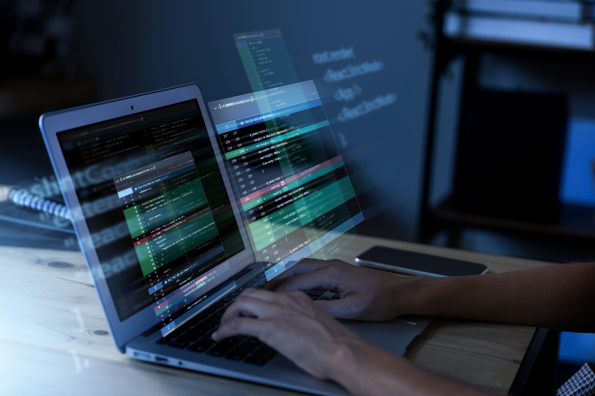

# 2. Introducció al mòdul

{: style="display: block; margin-left: auto; margin-right: auto; width: 400px;" }

En este curs ens introduirem en els **fonaments de la programació** i aprendrem a crear programes informàtics de manera progressiva: des de plantejar la solució d’un problema fins a escriure, provar i depurar el codi.

El nostre llenguatge de programació serà **Python**, un llenguatge senzill d’aprendre i molt utilitzat actualment, que ens permetrà centrar-nos en els conceptes fonamentals de la programació.

## Unitats Didàctiques

**Fonaments bàsics de la programació**  
Coneixerem què és programar, què és un llenguatge de programació i quins tipus de llenguatges existeixen. També aprendrem alguns conceptes bàsics necessaris abans de començar a escriure codi.

**Les dades**  
Estudiarem com representen i manipulen les dades els programes. Introduirem conceptes com les variables, els tipus de dades i les operacions que podem realitzar amb elles, independentment del llenguatge de programació utilitzat.

**Introducció a Python**  
Prepararem l’entorn necessari per començar a programar en Python. Instal·larem l’intèrpret i veurem diferents entorns de desenvolupament que podem utilitzar per escriure i executar els nostres programes.

**Dades i operacions bàsiques en Python**  
Començarem a programar en Python. Aprendrem a mostrar informació per pantalla, introduir dades mitjançant el teclat i treballar amb els principals tipus de dades i operadors del llenguatge.

**Programació estructurada. Control de flux en Python**  
Aprendrem a plantejar algoritmes per resoldre problemes i a controlar l’ordre en què s’executen les instruccions d’un programa. Treballarem amb estructures de selecció i repetició, i començarem a desenvolupar **una manera de pensar pròpia de la programació**.

**Funcions**  
Aprendrem a dividir els programes en parts més menudes anomenades funcions. Això ens permetrà organitzar millor el codi, reutilitzar-lo i construir programes més clars i fàcils de mantindre.

**Llistes i matrius**  
Treballarem amb estructures que permeten guardar i manipular diverses dades alhora. Utilitzarem llistes i veurem també com representar estructures en forma de taula mitjançant matrius.

**Fitxers** 
Aprendrem a guardar informació generada pels nostres programes en fitxers i a recuperar-la posteriorment per poder tractar-la. Treballarem amb fitxers de text i amb formats habituals d’intercanvi de dades.
---

Este curs està pensat perquè adquirisques una **base sòlida de programació**, tant des del punt de vista conceptual com pràctic.

No és necessari haver programat abans. Els continguts s’introduiran de manera progressiva, combinant les explicacions amb exemples i exercicis que ens permetran posar en pràctica allò que anem aprenent.

Més endavant utilitzarem també una llibreria de Python per a crear xicotets jocs gràfics, on podrem aplicar molts dels conceptes treballats durant el curs.

L’objectiu final no és només aprendre la sintaxi de Python, sinó sobretot aprendre a analitzar problemes, plantejar solucions i transformar-les en programes.

---
