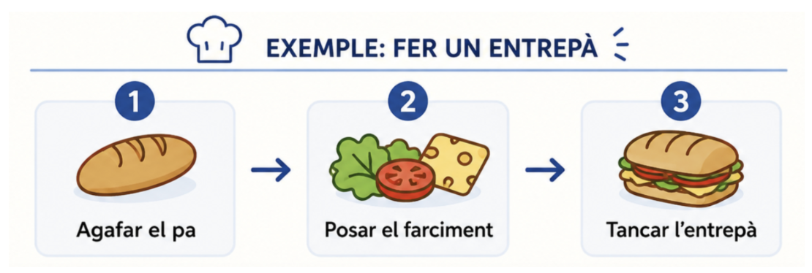
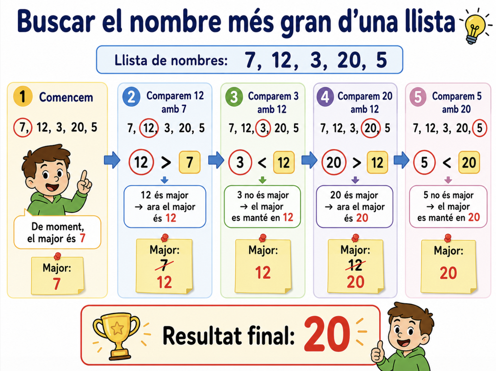

# Fonaments bàsics de la programació

## Què és la programació?

La **programació informàtica** és el procés de dissenyar i escriure instruccions que un ordinador pot entendre i executar.  
Eixes instruccions s'han de fer en un **llenguatge de programació** que permeta als humans comunicar-se amb les màquines.
Programar no és sols escriure codi per a resoldre problemes, sinó fer-ho de forma **estructurada i eficient**.

---

## Breu història de la programació

- **Anys 1840** – _Ada Lovelace_, la primera programadora, descriu un algoritme per a la màquina analítica de Charles Babbage.
- **Anys 1940** – Naixen els primers ordinadors electrònics (ENIAC) i els primers llenguatges de baix nivell (codi màquina i assemblador).
- **Anys 1950-1960** – Apareixen llenguatges d’alt nivell (_Fortran_, _COBOL_...), més propers al llenguatge humà.
- **Anys 1970-1980** – Popularització de _C_, _Pascal_ i la programació estructurada.
- **Anys 1990-2000** – Expansió de la programació orientada a objectes (_Java_, _C++_) i del web (_JavaScript_, _PHP_).
- **Actualitat** – Llenguatges com _Python_ destaquen per la seua senzillesa, potència i aplicació en camps com la intel·ligència artificial, la ciència de dades i el desenvolupament mòbil.

---

## Tipus de llenguatges segons el nivell d'abstracció

Els llenguatges es poden classificar de diferents formes. Una distinció habitual és segons el seu nivell d'abstracció, és a dir, segons la seua proximitat al llenguatge màquina (**baix nivell**) o al llenguatge humà (**alt nivell**).


- **Llenguatges de baix nivell**  
  - Propers al llenguatge de la màquina. 
  - Exemples: Codi màquina, llenguatge assemblador.  
  - Són molt ràpids i eficients, però difícils d’aprendre i usar.

- **Llenguatges d’alt nivell**  
  - Propers al llenguatge humà. 
  - Exemples: Python, Java, C#, JavaScript.  
  - Són més fàcils d’utilitzar i permeten escriure programes complexos amb menys esforç.

## Tipus de llenguatges segons el model d'execució


En esta classificació diferenciem entre llenguatges **compilats**, **interpretats** i **híbrids** segons el procés necessari per a executar el codi font.
Esta distinció influeix en el rendiment i la portabilitat dels programes.


### Llenguatges compilats

En els llenguatges **compilats**, el **codi font** (escrit pel programador) es tradueix, mitjançant un **compilador**, a un fitxer en **codi màquina**, que l'ordinador pot executar directament. La compilació es realitza abans de l'execució i genera habitualment un fitxer executable, que es pot utilitzar tantes vegades com es vulga sense tornar a compilar-lo, sempre que no es modifique el codi font. Aquest tipus de llenguatges sol oferir un major rendiment durant l'execució. Ara bé, cal generar un executable específic per a cada plataforma (sistema operatiu + arquitectura del processador)

Exemples: **C, C++, Rust**.

#### Procés de compilació:

1. Es compila el codi font: a partir d'un fitxer font, per a una plataforma en concret es genera un altre fitxer en codi màquina.
2. El programa resultant (fitxer executable) pot ser executat directament per eixa plataforma.

### Llenguatges interpretats

En els llenguatges **interpretats**, el fitxer que s'executa és el propi codi font (no hi ha codi màquina). Cada vegada que s'executa el programa, l'**intèrpret** va llegint cada línia, l'interpreta l'executa. Per tant, l'execució d'un programa pot ser més lenta (ja que ha d'anar interpretant i executant) però el cicle de prova i modificació és més immediat, ja que no s'ha de generar prèviament un executable. A més, el mateix codi font es pot executar directament en qualsevol plataforma (sense cap pas previ).

Exemples: **Python, JavaScript, Ruby**.

#### Procés d'interpretació:

- L'intèrpret llegeix i executa el codi font línia per línia.
- No es genera un fitxer executable separat, i el codi es necessita cada vegada que s'executa el programa.

### Llenguatges híbrids

Alguns llenguatges utilitzen una **combinació de compilació i interpretació** per a buscar un compromís entre rendiment i portabilitat.

Exemples: Java, C#

#### Procés de compilació i interpretació
En Java:

1. Es **compila** el codi font i genera uh fitxer en **bytecode**, igual per a totes les plataformes.
2. El bytecode és executat (**interpretat**) per una **màquina virtual** (JVM) diferent per a cada plataforma.


**Avantatges**
   - Portabilitat: el bytecode serveix per a totes les plataformes.
   - Rendiment: la interpretació de bytecode és més instantànea que la de codi font.


---

## Què és un algoritme?

Un **algoritme** és un conjunt ordenat i finit de passos que descriuen com resoldre un problema o aconseguir un objectiu.  
És com una recepta: una seqüència de passos que ens diu què hem de fer.



És la base de tota programació.

### Propietats d’un bon algoritme

- **Clar**: fàcil d’entendre.
- **Finit**: té un principi i un final.
- **Eficaç**: resol el problema dins de recursos raonables.
- **Generalitzable**: pot aplicar-se a casos semblants.

!!! example "Exemple d'algoritme en pseudocodi: màxim de dos números"

    ```text
    INICI
        Llegir A
        Llegir B
        SI A > B LLAVORS
            Mostrar A " és el major"
        SI_NO
            Mostrar B " és el major"
    FI
    ```

---

## El pseudocodi

El **pseudocodi** és un llenguatge intermig entre el llenguatge natural i el llenguatge de programació.  
Serveix per a descriure algoritmes de manera clara i sense preocupar-se per la sintaxi estricta d’un llenguatge.

### Exemple en pseudocodi: càlcul de l’àrea d’un cercle

```text
INICI
    Llegir radi
    area ← PI * radi * radi
    Mostrar area
FI
```

### Avantatges del pseudocodi

- Fàcil d’entendre per humans.
- Ajuda a planificar abans de programar.
- Independent del llenguatge de programació.

---

## Exemples d’aplicació de la programació

- **Desenvolupament d'aplicacions**: aplicacions web, mòbils i d'escriptori.
- **Videojocs i entreteniment digital**.
- **Intel·ligència artificial i tractament de dades**: reconeixement facial, recomanacions, traducció automàtica, etc.
- **Ciència, enginyeria i simulació**: càlculs, simulacions físiques, trajectòries, models científics...
- **Automatització i control de sistemes**: automatitzar tasques repetitives i controlar robots, sensors, màquines o altres dispositius.

En definitiva, la programació és una **eina universal** que permet transformar problemes en solucions pràctiques.


## La manera de pensar d’un programador

Aprendre a programar no és sols dominar un llenguatge de programació, sinó **aprendre a pensar d’una forma estructurada i lògica** per a trobar solucions eficients a problemes complexos.

### Característiques d’aquesta forma de pensar

Sobretot en problemes extensos caldria aplicar:

- **Descomposició**: dividir un problema gran en parts més xicotetes i manejables.  
- **Abstracció**: ignorar els detalls innecessaris i centrar-se en allò essencial.  
- **Pensament lògic**: utilitzar raonaments clars i precisos per prendre decisions.  
- **Creativitat**: trobar diferents camins per arribar a una solució.  
- **Precisió**: expressar instruccions d’una manera que l’ordinador puga entendre sense ambigüitats.

### Exemple 
Imaginem que volem fer un programa que indique quin és el nombre més gran d'una llista.
Abans d'escriure codi, hem de pensar com ho faria qualsevol persona encara que no sabera programar, a partir d'una llista de números d'exemple:



Una vegada hem pensat la solució, el següent pas és **transformar eixa idea en un algoritme**. 

En la solució que hem plantejat podem identificar:

- Un pas inicial: obtindre la llista i guardar el primer com a major.
- Uns passos que es repeteixen per a cada element de la llista:
    - Comparar-lo amb el major actual.
    - Si és més gran, actualitzar el major.
- Un pas final: mostrar eixe major.
  
Per tant, podem expressar aquestos passos en pseudocodi. Més avant vorem en detall instruccions d'assignació, bifurcació, repetició...

```text
INICI
    llista ← [7, 12, 3, 20, 5]

    major ← llista[0]

    Per cada nombre de llista fer
        Si nombre > major llavors
            major ← nombre
        FiSi
    FiPer

    Escriu "El nombre major és: ", major
FI
```

Això és el que fa un programador: **analitzar un problema i organitzar una seqüència de passos per a arribar a una solució**.

Una vegada tenim l'algoritme, passar-lo a un programa consisteix principalment a expressar eixos mateixos passos amb la sintaxi del llenguatge de programació que utilitzem.

---

!!! note "Exercici"
    Tria un d’aquests problemes i escriu el seu **algoritme en pseudocodi**:

    1. Algoritme que calcule la mitjana de 3 notes i mostre si està **aprovada** (≥5) o **suspesa** (<5).  
   
    2. Algoritme que pregunte l’edat d’una persona i mostre si és **menor d’edat**, **adult** o **jubilat** (>65). 

    3. Algoritme que done la **taula de multiplicar** d’un número introduït per teclat.  

!!! note "Repte extra"
    Dissenya en pseudocodi un **algoritme creatiu** per a un problema quotidià (per exemple: preparar-se per anar a l’institut, organitzar un viatge, o triar quina sèrie mirar a Netflix). Intenta posar estructures condicionals (si/si_no) o repetitives (mentre...).

---

!!! note "Rreflexió final"
    Donat un determinat problema, què creus que és més difícil: inventar l’algoritme o traduir-lo a pseudocodi (o programa)?  

**Recorda**: La millor forma d'aprendre a programar és programant.

---
