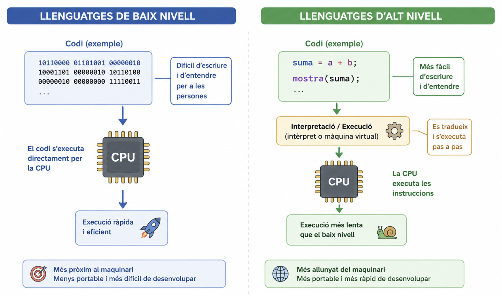
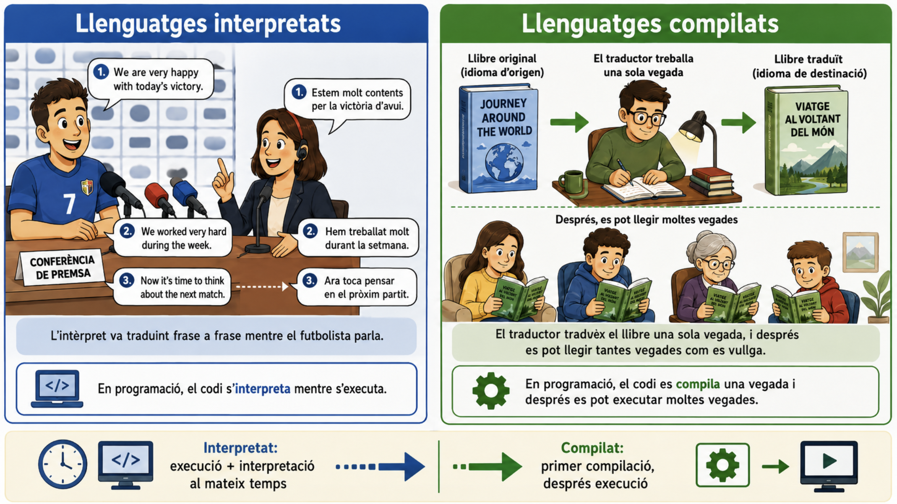
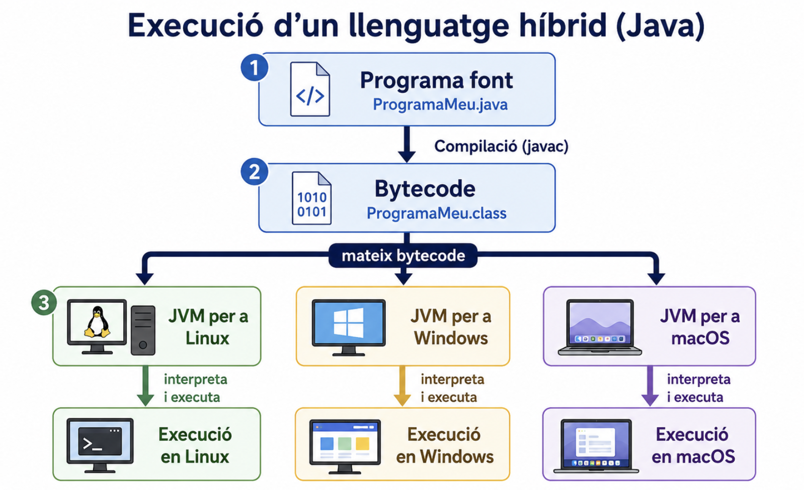

# Fonaments bàsics de la programació

En esta unitat introduirem els conceptes fonamentals de la programació: què és un llenguatge de programació, les principals classificacions existents i utilitats.

## 1. Què és la programació?

La **programació informàtica** és el procés de dissenyar i escriure instruccions que un ordinador pot entendre i executar.  
Eixes instruccions s'han de fer en un **llenguatge de programació** que permeta als humans comunicar-se amb les màquines.
Programar no és sols escriure codi per a resoldre problemes, sinó fer-ho de forma **estructurada i eficient**.

---

## 2. Breu història de la programació

- **Anys 1840** – _Ada Lovelace_, la primera programadora, descriu un algoritme per a la màquina analítica de Charles Babbage.
- **Anys 1940** – Naixen els primers ordinadors electrònics (ENIAC) i els primers llenguatges de baix nivell (codi màquina i assemblador).
- **Anys 1950-1960** – Apareixen llenguatges d’alt nivell (_Fortran_, _COBOL_...), més propers al llenguatge humà.
- **Anys 1970-1980** – Popularització de _C_, _Pascal_ i la programació estructurada.
- **Anys 1990-2000** – Expansió de la programació orientada a objectes (_Java_, _C++_) i del web (_JavaScript_, _PHP_).
- **Actualitat** – Llenguatges com _Python_ destaquen per la seua senzillesa, potència i aplicació en camps com la intel·ligència artificial, la ciència de dades i el desenvolupament mòbil.

---

## 3. Tipus de llenguatges segons el nivell d'abstracció

Els llenguatges es poden classificar de diferents formes. Una distinció habitual és segons el seu nivell d'abstracció, és a dir, segons la seua proximitat al llenguatge màquina (**baix nivell**) o al llenguatge humà (**alt nivell**).

- **Llenguatges de baix nivell**  
  - Propers al llenguatge de la màquina. 
  - Exemples: Codi màquina, llenguatge assemblador.  
  - Són molt ràpids i eficients, però difícils d’aprendre i usar.

- **Llenguatges d’alt nivell**  
  - Propers al llenguatge humà. 
  - Exemples: Python, Java, C#, JavaScript.  
  - Són més fàcils d’utilitzar i permeten escriure programes complexos amb menys esforç.

## 4. Tipus de llenguatges segons el model d'execució

En esta classificació diferenciem entre llenguatges **compilats**, **interpretats** i **híbrids** segons el procés necessari per a executar el codi font.
Esta distinció influeix en el rendiment i la portabilitat dels programes.

### Llenguatges compilats

En els llenguatges **compilats**, el **codi font** (escrit pel programador) es tradueix, mitjançant un **compilador**, a un fitxer en **codi màquina**, que l'ordinador pot executar directament. La compilació es realitza abans de l'execució i genera habitualment un fitxer executable, que es pot utilitzar tantes vegades com es vulga sense tornar a compilar-lo, sempre que no es modifique el codi font. Aquest tipus de llenguatges sol oferir un major rendiment durant l'execució. Ara bé, cal generar un executable específic per a cada plataforma (sistema operatiu + arquitectura del processador)

Exemples: **C, C++, Rust**.

#### Procés de compilació

1. Es compila el codi font: a partir d'un fitxer font, per a una plataforma en concret es genera un altre fitxer en codi màquina.
2. El programa resultant (fitxer executable) pot ser executat directament per eixa plataforma.

### Llenguatges interpretats

En els llenguatges **interpretats**, el fitxer que s'executa és el propi codi font (no hi ha codi màquina). Cada vegada que s'executa el programa, l'**intèrpret** va llegint cada línia, l'interpreta l'executa. Per tant, l'execució d'un programa pot ser més lenta (ja que ha d'anar interpretant i executant) però el cicle de prova i modificació és més immediat, ja que no s'ha de generar prèviament un executable. A més, el mateix codi font es pot executar directament en qualsevol plataforma (sense cap pas previ).

Exemples: **Python, JavaScript, Ruby**.

#### Procés d'interpretació

- L'intèrpret llegeix i executa el codi font línia per línia.
- No es genera un fitxer executable separat, i el codi es necessita cada vegada que s'executa el programa.

### Llenguatges híbrids

Alguns llenguatges utilitzen una **combinació de compilació i interpretació** per a buscar un compromís entre rendiment i portabilitat.

Exemples: Java, C#

#### Procés de compilació i interpretació
En Java:

1. Es **compila** el codi font i genera uh fitxer en **bytecode**, igual per a totes les plataformes.
2. El bytecode és executat (**interpretat**) per una **màquina virtual** (JVM) diferent per a cada plataforma.

**Avantatges**
   - Portabilitat: el bytecode serveix per a totes les plataformes.
   - Rendiment: la interpretació de bytecode és més instantànea que la de codi font.

---

## 5. Exemples d’aplicació de la programació

- **Desenvolupament d'aplicacions**: aplicacions web, mòbils i d'escriptori.
- **Videojocs i entreteniment digital**.
- **Intel·ligència artificial i tractament de dades**: reconeixement facial, recomanacions, traducció automàtica, etc.
- **Ciència, enginyeria i simulació**: càlculs, simulacions físiques, trajectòries, models científics...
- **Automatització i control de sistemes**: automatitzar tasques repetitives i controlar robots, sensors, màquines o altres dispositius.

En definitiva, la programació és una **eina universal** que permet transformar problemes en solucions pràctiques.

---
