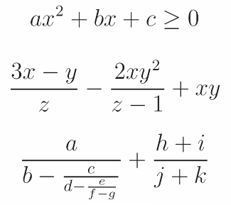

# Exercicis

## 1. Avaluació d’expressions

Calcula el valor de cada expressió si és vàlida. Si no és vàlida, indica el motiu.

```python
a) 10 * 3 + 5 * 2
b) 2 + 8 / 2
c) 4 + "preu"
d) (5 + 2) < 8
e) 4 >= 4
f) True or False
g) 5 or (2 < 3)
h) (6 >= 2) or (3 <= 5)
i) not (not (not (4 < 10)))
j) ((10 - 4) > 0) or True
k) "Hola, món!" == "Hola," + "món!"
l) 'a' == 'A'
```

## 2. Construcció d’expressions

Construeix expressions correctes per a representar les fórmules següents:



## 3. Expressions lògiques

A partir de les variables següents:

```python
gran = False
redo = True
suau = False
```

indica quin serà el valor de les expressions:

```python
a) gran and not redo
b) gran or redo or suau
c) gran and suau or redo
d) gran and (suau or redo)
```

## 4. Lleis de De Morgan

Transforma les expressions següents en altres d’equivalents utilitzant les lleis de De Morgan.

Tingues en compte que `a`, `b` i `c` són variables enteres, mentre que `p`, `q` i `r` són variables booleanes (lògiques).

```python
a) not (p and q and r)
b) not ((p and q) or r)
c) not ((a == b) or (a < b))
d) not (not (a != b) or (a + b == 7))
```

## 5. Seguiment de variables

Indica què valdrà cada variable després de cadascuna de les assignacions d’aquest programa:

```python
a = 4 + 2 * 3
b = a + 2
p = b == 12
q = not p
b = a + b
p = p and (a > b)
b = b - 2
```

## 6. Construcció d'expressions

Construeix una expressió lògica per a cadascun dels casos següents, tenint en compte que `a`, `b`, `c` i `d` són variables numèriques.

El primer està resolt com a exemple.

a) El valor de `a` és més del doble que el de `b`.

    ```python
    a > 2 * b
    ```

b) `a` és major que `b` però menor que `c`.
c) Els valors de `b` i `c` són majors o iguals que `d`.
d) `a`, `b` i `c` són idèntics.
e) `a`, `b` i `c` són idèntics però diferents de `d`.
f) `b` té un valor comprés entre `a` i `c`, i `a` és menor que `c`.
g) `b` té un valor comprés entre `a` i `c`.
h) Almenys dos dels valors `a`, `b` i `c` són iguals.

## 7. Construcció d'expressions
a) Pep i Pepa han nascut el mateix any. El dia i el mes de naixement de Pep estan guardats en les variables `diaPep` i `mesPep`, i els de Pepa en `diaPepa` i `mesPepa`. Construeix una expressió lògica que indique que **Pep és més jove que Pepa**.
b) Quina seria l'expressió si també tenim en compte els anys de naixement (`anyPep` i `anyPepa`)?
