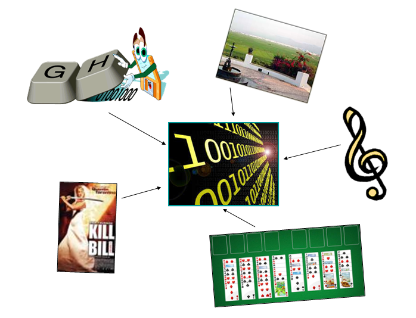

# 1. Introducció

Un programa és una seqüència d’instruccions que **manipulen unes dades per a obtindre uns resultats**.

**DADES → PROGRAMA → RESULTATS**

Les instruccions d’un programa són ordres que donem a l’ordinador. Internament, l’ordinador treballa amb **llenguatge màquina**, format per seqüències de `0` i `1`. Tota la informació que emmagatzema —números, text, imatges, música, jocs, pel·lícules...— acaba representant-se d’aquesta manera.

Com que escriure directament en llenguatge màquina seria molt difícil per a nosaltres, utilitzem **llenguatges de programació**. En aquest mòdul treballarem amb **Python**.

En aquest tema estudiarem les dades que tracten els programes: **com es guarden i quines operacions podem fer amb elles**. Molts dels conceptes que veurem són comuns a altres llenguatges de programació.

!!! info "En aquest tema"
    Veurem tres idees principals:

    - què és una dada i com es guarda en una **variable**;
    - què és una **expressió**;
    - quins **operadors** podem utilitzar i en quin ordre s’avaluen.
