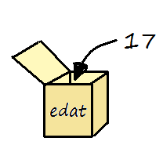
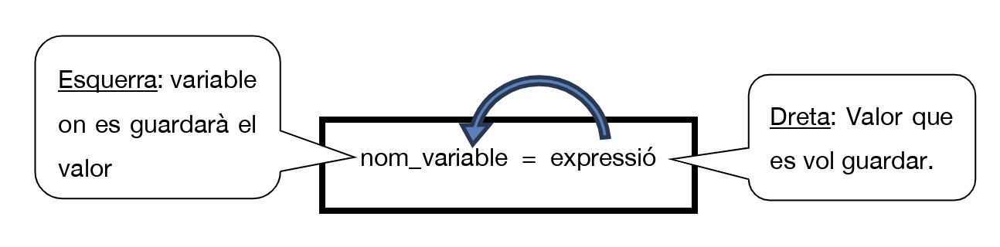

# 2. Variables

Una **dada** és qualsevol informació amb la qual treballa un programa.

Cada dada és d’un **tipus** determinat. Alguns dels tipus més habituals són:

| Tipus de dada | Exemple en Python | Tipus Python |
|---|---|---|
| Enter | `17` | `int` |
| Decimal | `1.68` | `float` |
| Text | `"Anna"` | `str` |
| Lògic | `True` / `False` | `bool` |

Les dades d’un programa es poden guardar en **variables**. Una variable és com una caixa a la qual posem un nom i en la qual podem guardar un valor.



En la imatge, la variable `edat` guarda el valor `17`. Aquest valor pot canviar durant l’execució del programa.

El **tipus de dada** determina, entre altres coses, quines operacions podem fer amb el valor. Per exemple:

- amb números podem sumar, restar, multiplicar...;
- amb cadenes de text podem convertir el text a majúscules, calcular-ne la longitud, etc.

## Assignació de valors

Per guardar un valor en una variable utilitzem l’operador d’assignació `=`:

```python
nom_variable = expressio
```



La part de la **dreta** s’avalua primer i el resultat es guarda en la variable de l’**esquerra**.

Per exemple:

```python
edat = 17
dies = edat * 365
```

Açò significa: 
- *Guarda el valor `17` en la variable `edat`*.
- *Multiplica `17` per `365`, i guarda el resultat, `6205`, en la variable `dies`*

!!! warning "Assignació no és comparació"
    En Python, `=` serveix per **assignar** un valor. Per comprovar si dos valors són iguals utilitzarem `==`.

## Exemple d’ús de variables

```python
nom = "Anna"              # Els textos van entre cometes
edat = 16
altura = 1.68              # Els decimals s'escriuen amb punt
es_estudiant = True        # Valor lògic: True o False

print("Edat inicial:", edat) # Mostra per pantalla: Edat inicial: 16

edat = 17                  # Podem canviar el valor d'una variable
edat = edat + 2            # Ara edat val 19

print("Edat nova:", edat)

any_naix = 2026 - edat # Es calcula la part dreta del '=' (2007),  i es guarda en any_naix
altura_cm = altura * 100 # Es guarda en altura_cm el valor 168
nom_majuscules = nom.upper() # Es guarda en nom_majuscules: "ANNA"

print("Nom:", nom)
print("Nom en majúscules:", nom_majuscules)
print("Any de naixement aproximat:", any_naix)
print("Altura en cm:", altura_cm)
print("És estudiant:", es_estudiant)
```

En una assignació com Esta:

```python
edat = edat + 2
```

no estem escrivint una igualtat matemàtica. Primer es calcula la part dreta (`edat + 2`) i després el resultat es torna a guardar en `edat`.
