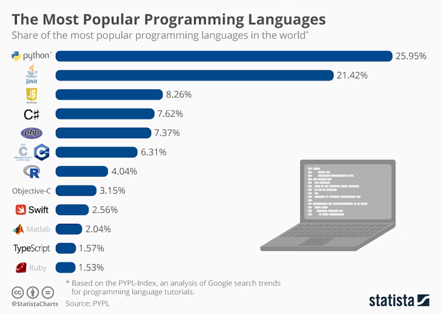
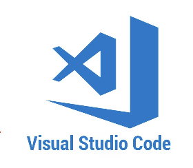

# Introducció a Python
{: style="display: block; margin-left: auto; margin-right: auto; width: 200px;" }
## 1. Què és Python?

**Python** és un llenguatge de programació de **molt alt nivell**, creat per **Guido van Rossum** i publicat per primera vegada en **1991**.

Destaca per tindre una **sintaxi simple i llegible**, és **interpretat** i funciona en els principals sistemes operatius, com Linux, macOS i Windows.

A més, disposa d'una àmplia biblioteca estàndard i de moltes biblioteques externes, i és àmpliament utilitzat en l'àmbit professional.

{: style="display: block; margin-left: auto; margin-right: auto; width: 800px;" }
Un primer programa en Python podria ser:

```python
print("Hola, món!")
```

Aquest programa mostra el text **Hola, món!** per pantalla.

---

Per a començar a programar necessitem, bàsicament:

1. **Python**, que és l'intèrpret encarregat d'executar els nostres programes.
2. **Un entorn de desenvolupament (IDE)**, que ens facilite escriure i executar el codi.

A més, al llarg del curs utilitzarem algunes **biblioteques** que amplien les possibilitats de Python.

A continuació vorem com instal·lar-ho tot.

---

## 2. Instal·lar Python

Python ja està preinstal·lat en moltes distribucions de Linux. Podem comprovar si està instal·lat obrint un terminal i escrivint:

```bash
python3 --version
```

Si apareix la versió instal·lada, ja podem utilitzar Python. Si no, cal instal·lar-lo:

- **macOS / Windows**: descarregar-lo de [python.org](https://www.python.org/) i executar l'instal·lador.
- **Ubuntu**:

```bash
sudo apt update
sudo apt install python3
```

Una vegada instal·lat, podem executar Python des del terminal amb:

- **Ubuntu / macOS**: `python3`
- **Windows**: `python`

Tot i això, utilitzarem un IDE per a facilitar el procés de programació.

---

## 3. Entorns de desenvolupament

Encara que podríem escriure els programes amb qualsevol editor de text i executar-los des del terminal, és més còmode utilitzar un **IDE**.

### Thonny

En este mòdul començarem amb **Thonny**, un entorn pensat especialment per a persones que estan començant a programar amb Python.


Ens permet, entre altres coses:

- escriure i executar programes Python fàcilment;
- vore els errors de manera clara;
- executar els programes pas a pas;
- observar com canvia el valor de les variables durant l'execució.

Thonny **no requereix instal·lar prèviament Python**, ja que incorpora el seu propi intèrpret.

Per a instal·lar-lo:

- **macOS / Windows**: descarregar-lo de [thonny.org](https://thonny.org) i executar l'instal·lador.
- **Ubuntu**:

```bash
sudo apt update
sudo apt install thonny
```

### Visual Studio Code

Més endavant també treballarem amb **Visual Studio Code (VS Code)**, un entorn més complet i molt utilitzat en l'àmbit professional.



Es pot descarregar des de [code.visualstudio.com](https://code.visualstudio.com).

- **macOS / Windows**: executar el fitxer descarregat.
- **Ubuntu**: descarregar el paquet `.deb` i instal·lar-lo amb:

```bash
sudo apt install ./nom_fitxer_vscode.deb
```

Per a treballar amb Python en VS Code, cal instal·lar l’extensió de Python. Fes clic a la icona d’Extensions, busca “Python” i instal·la la publicada per Microsoft.

---

## 4. Biblioteques de Python

Les **biblioteques** proporcionen funcionalitats que podem reutilitzar als nostres programes.

Podem distingir dos tipus principals:

### Biblioteques estàndard

Són les biblioteques que **ja venen incloses amb Python**, per tant **no cal instal·lar-les**.

Alguns exemples són:

- `math`, per a realitzar operacions matemàtiques;
- `random`, per a generar valors aleatoris;
- `datetime`, per a treballar amb dates i hores.

Per a utilitzar-les només cal importar-les:

```python
import math

print(math.sqrt(25))
```

### Biblioteques externes

Són biblioteques que **no formen part de la biblioteca estàndard de Python** i cal instal·lar-les abans d'utilitzar-les.

Alguns exemples són:

- `colorama`, per a posar colors i estils al text del terminal;
- `requests`, per a fer peticions HTTP.

Per a instal·lar-les utilitzem **pip**, el gestor de paquets de Python.

!!! note El gestor de paquets de Python (*pip*)
    Python sol incloure `pip`, però en algunes distribucions de Linux pot ser necessari instal·lar-lo.

    Per a comprovar si està instal·lat:

    ```bash
    python3 -m pip --version
    ```

    Si no està instal·lat en Ubuntu:

    ```bash
    sudo apt install python3-pip
    ```

Per tant, per a usar una biblioteca externa cal:

1. **Instal·lar-la** una vegada amb `pip`.
2. **Importar-la** en cada programa que la necessite.

!!! example Exemple amb `colorama`

    Primer instal·lem la biblioteca des del terminal:

    ```bash
    python3 -m pip install colorama
    ```

    En Thonny també podem instal·lar-la des de **Eines → Gestiona els paquets**.

    Després, la importem en el programa:

    ```python
    import colorama

    print(colorama.Fore.RED + "Text en roig")
    ```

---

Ara ja tenim Python i l'entorn de treball preparats per a començar a programar.
