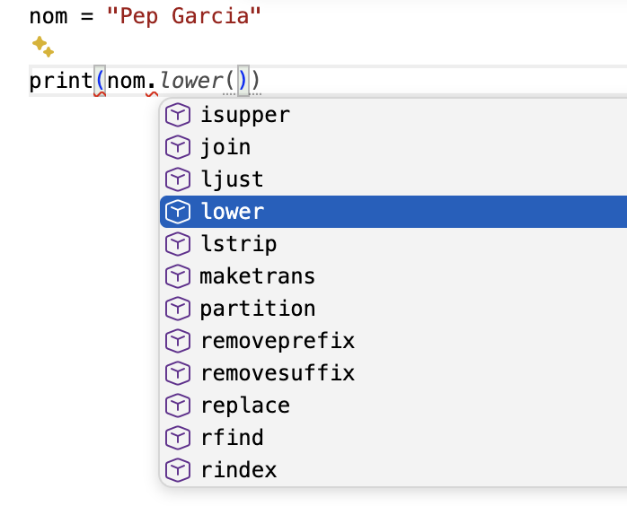
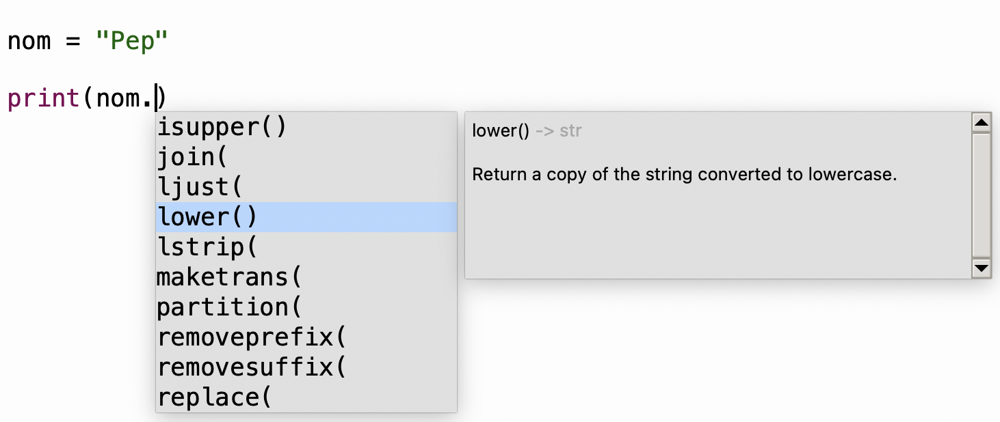

# UD4. Dades i operacions bàsiques en Python

## 1. Algunes característiques bàsiques de Python

### Sagnat del codi

En Python, el **sagnat** (espais al principi d’una línia) s’utilitza per a indicar quines instruccions formen part d’un mateix **bloc de codi**.
Les instruccions que tenen el mateix nivell de sagnat pertanyen al mateix bloc i s’executaran juntes quan es complisca la condició corresponent.

```python
edat = int(input("Edat:"))

if edat >= 18:
  print("Eres major d'edat")
  print("Pots votar")
else:
  print("Eres menor")
  print("No pots votar")

print("Fi del programa")
```

Encara no hem vist en detall la instrucció `if`, però podem observar que el **sagnat** ens permet identificar els diferents blocs de codi:

- Un bloc, amb dos *print*, que s’executaria si es compleix la condició.
- Un altre bloc, amb altres *print* que s’executaria en cas contrari.

### Comentaris

Els comentaris permeten afegir anotacions al codi: amb `#` per a una línia i entre `'''` per a diverses línies.

```python
# Comentari d'una línia

nom = "Anna" # Comentari al costat del codi

'''
Comentari de diverses línies.
Pot ocupar tantes línies com necessitem.
'''

print(nom)
```

### Noms de variables en Python

- No han de començar per un número

- No poden haver símbols especials ni operadors: \[, !, @, \#, \$, %, \*, ...

- No poden ser paraules reservades: *import, True, False, if, or, in...*

Python és case-sensitive: *edat* i *Edat* són variables diferents.

## 2. Tipus de dades

Les dades que manegen els programes són de distints **tipus**: lletres, números sense decimals, amb decimals... 
Els tipus de Python són:

- `int`: números enters (sense decimals)
- `float`: números amb decimals
- `str`: text (*string*)
- `bool`: lògic o booleà (únics valors: *True*, *False*)

!!! example "Exemple dels tipus de les variables"
    Les variables seran del tipus del valor que se li assignen:
    ```python
    edat = 30           # int
    pes = 74.5          # float (s'usa és el punt decimal, no la coma)
    nom = "Pep Garcia"  # str (també pot anar entre cometes simples)
    casat = True        # bool 
    ```

!!! example "Veiem com d'important pot ser el tipus"
    ```python
    a = 5
    b = 3
    print(a + b)  # 8, ja que ací el ‘+’ suma números

    a = "5"
    b = "3"
    print(a + b)  # "53", ja que ací el ‘+’ concatena cadenes

    a = "5"
    b = 3
    print(a + b)  # ERROR, ja que no es pot sumar ni concatenar un número amb un text
    ```

Python usa **tipificació dinàmica**: una variable pot canviar de tipus en un programa:

!!! example "Exemple de tipificació dinàmica"
    Veiem com en un programa una variable pot canviar de tipus:
    ```python
    ...
    n = 7     # Primera vegada que ix la variable n. Ara la n val 7 Per tant, és int.
    n = 5.67  # Ara n val 5.67. Per tant, ara és float.
    n = 9     # Ara n val 9. Per tant, continua sent int.
    n = n+2   # Ara n 11. Continua sent int.
    n = n/4   # Ara n val 2.75. Per tant, ara n és float.
    n = "Pep" # Ara n és str (cadena)
    ...
    ```

## 3. Operadors

Operadors de Python ordenats de major a menor prioritat dins d’una expressió.

<table>
<colgroup>
<col style="width: 28%" />
<col style="width: 71%" />
</colgroup>

<thead>
<tr style="background-color:#c8eeee">
<th>OPERADORS</th>
<th>OBSERVACIONS</th>
</tr>
</thead>

<tbody>

<tr style="background-color:#e9f0df">
<td style="text-align:center">**</td>
<td>Potència. Exemple: 2 ** 3 —&gt; 8.</td>
</tr>

<tr style="background-color:#e9f0df">
<td style="text-align:center; word-spacing: 12px">+x -x</td>
<td>
<p>Signe positiu o negatiu (operadors unaris).</p>
<p>Exemple: descompte = <strong>-</strong>10</p>
</td>
</tr>

<tr style="background-color:#e9f0df">
<td style="text-align:center; word-spacing: 12px">* / // %</td>

<td>
<p>Exemples:</p>
<p>print(21 * 4) # 84 → multiplicació</p>
<p>print(21 / 4) # 5.25 → divisió amb decimals</p>
<p>print(21 // 4) # 5 → divisió entera (arredoneix cap a baix)</p>
<p>print(21 % 5) # 1 → residu de divisió entera</p>
<p>&nbsp;&nbsp;&nbsp;&nbsp;&nbsp;&nbsp;&nbsp;&nbsp(21 dividit entre 5 és 4... i <strong>en sobra 1</strong>)</p>
</td>
</tr>

<tr style="background-color:#e9f0df">
<td style="text-align:center; word-spacing: 12px">+ -</td>
<td>Suma i resta. El + també pot concatenar cadenes.</td>
</tr>

<tr style="background-color:#dce8f5">
<td style="text-align:center; word-spacing: 12px">&lt; &lt;= &gt; &gt;= == !=</td>

<td>Operadors relacionals: menor, menor o igual, major, major o igual, igual i distint.</td>
</tr>

<tr style="background-color:#fae7d5">
<td style="text-align:center">not</td>
<td>Obtén el valor lògic contrari.</td>
</tr>

<tr style="background-color:#fae7d5">
<td style="text-align:center">and</td>
<td>Només és vertader si les dues condicions són vertaderes.</td>
</tr>

<tr style="background-color:#fae7d5">
<td style="text-align:center">or</td>
<td>És vertader si almenys una de les condicions és vertadera.</td>
</tr>

</tbody>
</table>
Els parèntesis poden utilitzar-se per a modificar l’ordre d’avaluació.

!!! question "Exercici sobre operadors de Python"

    1. Digues què mostrarà exactament cada *print*:
    ```python
    print(14 / 4)

    print(14 // 4)

    print(14 % 4)

    print(14 <= 4)

    print(14 - -4)
    ```
     2. Escriu una expressió on s’especifique que una variable numèrica de nom *quant* siga menor o igual que 500, múltiple de 5 o de 3 i distinta de 100.
   
### Operador d'assignació

Este operador ja ha aparegut en molts exemples. S'utilitza quan volem assignar un valor a una variable.

!!! example "Exemples d'assignacions"
    Recordem que a l'esquerra es posa la variable on volem guardar el valor, desrpés el `=` i després el valor que volem guardar.
    ```python
    x = 10        # x ara valdrà 10
    y = 20        # y ara valdrà 20
    x = y/2 + 3   # x ara ja no valdrà 10, sinó 13.0
    y = x + y//2  # y ara ja no valdrà 20, sinó 23.0
    ```

Si volem **assignar el mateix valor a diverses variables**, podem fer-ho
en una sola instrucció:

```python
a = b = c = d = 0
```

### Operadors d'assignació reduïts

Els operadors `+=` i `-=` permeten modificar el valor d'una variable utilitzant el seu valor actual, sense haver de repetir el nom de la variable. És a dir:

| Operador reduït| Equivalència |
|----------|--------------|
| `x += valor` | `x = x + (valor)` |
| `x -= valor` | `x = x - (valor)` |

Així evitem repetir el nom de la variable.

!!! example "Exemples d'ús d'operadors reduïts"

    ```python
    x = 7
    y = 4

    x += 2
    # Equivalent a: x = x + 2
    # x = 7 + 2   →   x = 9

    x -= 2 + y
    # Equivalent a: x = x - (2 + y)
    # x = 9 - (2 + 4)   →   x = 3
    ```


Altres operadors d’assignació reduïts (no tan freqüents): `*=`, `/=`, `//=`, `%=`, `**=`

!!! question "Exercici sobre assignacions en Python"

    3. En el següent programa, què valdrà la variable `a` després de cada assignació?
    ```python

    a = 6
    
    b = 3
    
    a = 2 + b         # a =
    
    a += 2            # a =
    
    a -= 2 + b        # a =
    
    ```

## 4. Expressions

Ja veiérem que una **expressió** combina **dades** i **operadors**. I també tractàrem els tipus de dades d'una dada o d'una expressió.
A vegades convindrà canviar el tipus d'una expressió. Veiem per què i com fer-ho en Python.

### Conversió de tipus d’una expressió (*càsting*)

Si ens convé, podem convertir el tipus d’una expressió a un altre tipus:

- int( expressió )
- float( expressió )
- str( expressió )
- bool( expressió )

!!! example "Exemples de càsting"
    El càsting pot afectar a una variable o a una expressió:
    ```python
    x = 4.6
    n = int(x) * 2     # n = int(4.6) * 2   --> n = 4 * 2     --> n = 8
    n = int(x * 2)     # n = int(4.6 * 2)   --> n = int(9.2)  --> n = 9
    euros = 10
    print( int(euros * 166.386) ) # Mostrarà 1663 (lleva la part decimal)
    telefon = 961702294 # Ara telefon és enter. Podríem sumar-li números, etc.
    telefon = str(telefon)  # Ara telefon és una cadena (“961702294”). Podríem concatenar, etc.
    ```

    Una utilitat típica de càsting és poder concatenar text amb números:
    ```python

    num = 20
    domicili = "C/ Sequial, número " + num       # Error: + no uneix text amb números
    domicili = "C/ Sequial, número " + str(num)  # Cal usar càsting
    ```

!!! question "Exercicis sobre càsting"

    4. Indica què mostraran els *print*

    ```python
    x = 2.5
    y = 0.6
    preu = "12 €"
    altura = "1,79"
 
    print(int(x) + int(y))

    print(int(x + y))

    print(int(preu))

    print(float(altura))


    ```

## 5. Eixida de dades: `print`

Ja hem vist que en el *print* li podem posar diferents valors separats per comes.

```python
nom = "Pep"
cog = "Garcia"
print("Hola", nom, cog) 
print("Fi del programa")
```

L'eixida per pantalla serà:
```text
Hola Pep Garcia
Fi del programa
```

És a dir, un print:

- Mostra en la mateixa línia els distints valors, separats per un espai.
- El següent print mostra les dades en altra línia.

I si no volem que els separe per un espai? I si no volem que passe a la línia següent? I si no volem que les dades es mostren per pantalla sinó que es guarden en un fitxer? Veiem com fer-ho.

### Altres paràmetres del *print*

Al print li podem indicar el comportament, a més dels objectes que volem mostrar:

*print*(objectes, ***sep***=separador, ***end***=finalitzador, ***file***=fitxer)

- En la primera part del print està la llista d'objectes que volem mostrar (el que hem fet fins ara): textos, números, variables o expressions que volem mostrar (separats per comes).
```python
dies = 3
print("En", dies, "dies hi ha", dies*24, "hores")  # En 3 dies hi ha 72 hores
```

- ***sep***=separador
  Hem vist que el *print* mostra els valors que li passem separats per un espai. Si en compte de l'espai volem posar altra cosa, hem d'usar el `sep`. 
```python
any = 2026
mes = 9
dia = 25
print(dia, mes, any)                # 25 9 2026
print(dia, mes, any, sep="/")       # 25/9/2026
print(dia, mes, any, sep=" del ")   # 25 del 9 del 2026
print(dia, mes, any, sep="")        # 2592026
```

- ***end***=finalitzador
  Hem vist que el *print* fa un salt de línia (intro) quan acaba de mostrar els seus valors (cada print el mostra en una línia diferent). Si no volem que faça eixe intro, hem d'usar l'`end`.
```python
print("Preu: ", end="")   # Mostra "Preu:" però NO fa un intro
print(25, end=" € ")      # Mostra 25 i després la cadena " € " però NO fa intro
print("amb IVA")          # És com si tinguera end='\n'. Per tant, sí que fa intro
print("A pagar")          # Ja ho mostra a la línia següent (perquè ha fet intro)
```
El resultat per pantalla serà:

    ```text
    Preu: 25 € amb IVA
    A pagar
    ```

- ***file*=fitxer** 
  Hem vist que el que li posem al print ix per pantalla. Si en compte d'això volem guardar-ho en un fitxer hem d'usar el `file`.
``` python
fitxer = open("provetes.txt", "a")  # Obrim un fitxer (si no existeix, el crea)

print("Nom: Pep", file=fitxer)      # Escriu al fitxer (no per pantalla)        
print("Edat: 17 anys", file=fitxer)
print("Curs: SMX", file=fitxer)

fitxer.close()                      # Tanquem el fitxer
```

    !!! success "Contingut del fitxer `provetes.txt` "
        ... (Dades anteriors)<br>
        Nom: Pep<br>
        Edat: 17 anys<br>
        Curs: SMX<br>


### Ús de f-strings (cadenes amb format)

Amb els **f-strings** es pot formar fàcilment una cadena de text barrejant text, variables i expressions.

Per exemple, si tenim:

```python
nom = "Pep"
edat = 17
anyActual = 2026
```

I vull mostrar per pantalla un text que diga...

```text
Em dic Pep i vàig nàixer en 2009
```
...ho puc fer de diverses maneres:


```python
# a) Passant al print diversos paràmetres (separats per coma):
print("Em dic", nom, "i vaig nàixer en ", anyActual - edat)

# b) Passant al print un sol paràmetre: una cadena que concatena text i valors:
print("Em dic " + nom + " i vaig nàixer en " + str(anyActual - edat))

# c) Passant al print un f-string (recomanat):
print( f"Em dic {nom} i vaig nàixer en {anyActual - edat}")
```

!!! note "Sintaxi del *f-string*"
    **f"**... **{** valor **}** ... **{** valor **}** ... **{** valor **}** ...**"**

    És a dir:<br>
    - S’escriu una **f** davant de les cometes.<br>
    - I els valors (variables o expressions) van entre claus **{ }**.<br>


    També podem indicar, amb `:`, el format en què volem mostrar cada valor:

    **f"**... **{** valor **: format }** ... **{** valor **: format }** ... **{** valor **: format }** ...**"**
    
    Ara vorem què posar en eixe **format**.


#### Format dels valors d'*f-string*
  
Suposem que tenim estes 2 variables:
```python
nom = "Pep"
x = 7
```

Veiem com podem indicar el format que volem per a eixos valors usant els *f-string*:

- En **quants espais** volem mostrar el valor:

| Format | Resultat | Explicació |
|--------|----------|------------|
| `f"{nom:8}"` | <code>"Pepa&nbsp;&nbsp;&nbsp;&nbsp;"</code> | En un espai de 8, posa el **text a l’esquerra** |
| `f"{x:8}"` | <code>"&nbsp;&nbsp;&nbsp;&nbsp;&nbsp;&nbsp;&nbsp;7"</code> | En un espai de 8, posa el **número a la dreta** |

- **L'alineació**: centrat (`^`), a l’esquerra (`<`) o a la dreta (`>`), i en quants espais:

| Format | Resultat | Explicació |
|--------|----------|------------|
| `f"{x:>8}"` | <code>"&nbsp;&nbsp;&nbsp;&nbsp;&nbsp;&nbsp;&nbsp;7"</code> | Alinea a la dreta, en una amplària de 8 |
| `f"{x:<8}"` | <code>"7&nbsp;&nbsp;&nbsp;&nbsp;&nbsp;&nbsp;&nbsp;"</code> | Alinea a l’esquerra, en una amplària de 8 |
| `f"{x:^8}"` | <code>"&nbsp;&nbsp;&nbsp;7&nbsp;&nbsp;&nbsp;&nbsp;"</code> | Centra el valor, en una amplària de 8 |

- **Quants decimals** volem en un `float`:

| Format | Resultat | Explicació |
|--------|----------|------------|
| `f"{pi:.2f}"` | `3.14` | Mostra el número amb 2 decimals |

- I podem combinar eixos formats. Per exemple, podem centrar un número `float` en un espai de 8 i mostrar-lo amb 2 decimals:

| Format | Resultat | Explicació |
|--------|----------|------------|
| `f"{pi:^8.2f}"` | <code>"&nbsp;&nbsp;3.14&nbsp;&nbsp;"</code> | Centra el número en una amplària de 8 i mostra 2 decimals |

!!! example "Exemples d'ús de *f-string*"
    ```python
    nom = "Pep"
    edat = 30
    pi = 3.14159265359

    print(f"Soc {nom} i tinc {edat} anys")  # Soc Pep i tinc 30 anys

    print(f"Tinc {edat:<10} anys")          # Tinc 10         anys

    print(f"Tinc {edat:>10} anys")          # Tinc         10 anys

    print(f"Tinc {edat:^10} anys")          # Tinc     10     anys

    print(f"Pi és {pi:.2f} aprox")          # Pi és 3.14 aprox

    print(f"Pi és {pi:>10.2f} aprox")       # Pi és       3.14 aprox
    ```

Realment, els *f-strings* no estan lligats necessàriament al *print()*. S’utilitzen per a crear cadenes de text que incorporen dades amb el format desitjat.

!!! example "Exemple de f-string no lligat a un print"
    ```python
    nom = "Pep"
    ...
    missatge = f"Hola, {nom}!"  # La variable 'missatge' valdrà: “Hola, Pep!”
    ...
    print(missatge)
    ```

### Operacions amb les cadenes (*str*)

Python disposa de moltes **operacions pròpies de les cadenes**: convertir-les a minúscules o majúscules, obtindre subcadenes, eliminar espais, substituir text, alinear el contingut, etc.

!!! example "Exemples d'operacions amb les cadenes"

    ```python
    nom = "   Pep Garcia   "

    nom = nom.strip()              # nom = "Pep Garcia" (lleva espais de principi i final)

    print(nom.count("a"))          # 2 (compta quantes 'a' té)

    nom = nom[0:3]                 # nom = "Pep" (agafa els 3 primers caràcters)

    print(f"Hola {nom.upper()} com va?")      # Hola pep com va? 
    print(f"Hola {nom.upper()} com va?")      # Hola PEP com va?
    print(f"Hola {nom.ljust(10)} com va?")    # Hola Pep        com va?
    print(f"Hola {nom.center(10)} com va?")   # Hola    Pep     com va?
    print(f"Hola {nom.rjust(10)} com va?")    # Hola        Pep com va?
    ```

    !!! info "Dos formes d'alinear un text"
        Observa que estes 2 instruccions fan el mateix:
          ```python
          print(f"Hola {nom.center(10)} com va?")
          print(f"Hola {nom:^10} com va?")
          ```

!!! note "Com podem vore les operacions disponibles d'una cadena?"
    En **VS Code**, si escrivim un punt després d’una variable de tipus `str`, apareix una llista amb els mètodes disponibles per a treballar amb eixa cadena.

    { width="50%" }

    En **Thonny**, si volem vore eixes funcions, hem de polsar `Ctrl + Espai` després d’escriure el punt.

    { width="50% }

!!! info "Operacions encadenades"
    Podem aplicar diverses operacions sobre un mateix text en una sola instrucció:

    ```python
    textInicial = " Hola Pep "

    textFinal = text.strip().lower().replace("pep", "món").capitalize()  # Hola món
    ```
    El que ha fet, i en eixe ordre, és:<br>
    1. *strip()* ha eliminat els espais de l'inici i final<br>
    2. *lower()* ho ha passat a minúscules<br>
    3. *replace("pep", "món")* ha reemplaçat "*pep*" per "*món*"<br>
    4. *capitalize()* ha posat la 1a lletra en majúscules.<br>


## 6. Entrada de dades: `input`

Serveix per a que un programa puga demanar dades per teclat.

```python
nom = input("Com et diuen?")        # nom = "Pep"
print(f"Hola, {nom}!")              # Hola, Pep!
```

L'input espera que posem alguna cosa per teclat (acabem amb intro). Després posa eixe valor en la variable (`nom` en este cas)

El text arreplegat per l'input sempre és de tipus `str` (text).

!!! warning "Què passa si llegim un número?"
    ```python
    num = input("Dis-me un número: ")   # num = "56"
    num = num + 1 # "TypeError: can only concatenate str (not "int") to str"
    ```

    **Error**: Com el valor llegit per l'input és de tipus *str* (text), en `num` tindrem un text (`"56"`), no un número (`56`). Per tant, l'expressió `num + 1` donarà error ja que Python no sap sumar (ni concatenar) textos amb números (`"56" + 1`).

!!! success "Solució: llegirem números usant `casting`"
    Per a llegir números de teclat cal usar càsting:
    ```python
    num = int( input("Dis-me un número: ") )
    num = num + 1
    ```
    El valor introduït (per exemple, `"56"`) el convertim, amb `int`, de text a enter (`56`, sense cometes). Per tant, el `num + 1` ara sumarà números i no donarà error (`56 + 1`).

    I si volem llegir números amb decimals usarem `float` en compte d'`int`.


### Diverses entrades en un mateix *input*:
Podem introduir *diverses dades en un mateix input()*, separades per un caràcter determinat.

!!! example "Exemple"
    ```python
    horaCompleta = input("Quina hora és (en format h:m:s): ")
    hores, minuts, segons = horaCompleta.split(":")
    ```

El mètode *split()* permet *dividir una cadena de text en diverses parts*. Entre parèntesis indiquem quin caràcter s'utilitzarà com a separador.

Si l'usuari introdueix:
```text
12:35:20
```

obtindrem estos valors:
```python
horaCompleta = "12:35:20"
hores = "12"
minuts = "35"
segons = "20"
```

Com podem vore, també podem fer diverses assignacions alhora:
```python
hores, minuts, segons = ...
```

Si no indiquem cap separador en *split()*, s'utilitzen els espais en blanc. Per exemple:

```python
pes, altura = input("Dis-me el pes i altura (separats per un espai").split()
```
Si l'usuari introdueix:
```text
75
1.80
```
s'obtindrà:
```python
pes = "75"
altura = "1.80"
```
!!! warning "Important"
    Els valors obtinguts continuen sent de tipus `str`. Si volem treballar amb ells com a números, haurem de fer els càstings corresponents:

    ```python
    pes, altura = input("Dis-me el pes i altura (separats per un espai").split()
    pes = int(pes)
    altura = float(altura)
    ```

En l'assignació hem de posar tantes variables com dades esperem obtindre amb *split()*. Si no, donarà error.

!!! question "Exercicis sobre entrada i eixida de dades"

    Fes els següents programes. El nom del fitxer serà ud4_n.py (on `n`és el número d'exercici). Utilitza els *f-string* per a mostrar les dades per pantalla.

    5. Fes un programa que pregunte quants anys té algú i que mostre per
    pantalla la quantitat d’anys que falten per a la majoria d’edat i per a
    jubilar-se.

    6. Programa que pregunte per la base i l’altura d’un triangle i mostre
    per pantalla l’àrea d’eixe triangle.

    7. Demana per teclat les dades de 2 llibres: títol, autor i preu
    (permet decimals). Després cal mostrar les dades en forma de taula: 30
    caràcters per al títol, 20 per a l'autor i 10 per al preu (incloent 2
    decimals i alineat a dreta). Per exemple:<br>

        ```text
        Diccionari per a ociosos      Joan Fuster               9.90 
        L'home manuscrit              Manuel Baixauli          21.25 
        ```

    8. Demana per teclat només un valor: una data (per exemple: "28/9/2026").
    Després escriu eixa data però amb el format: "28 del 9 de 2026".


    9. Troba els errors en el següent programa que calcula l’àrea d’un cercle a partir del radi. Després copia'l amb les correccions i executa’l per a vore si és correcte.

          ```python

          print("pi=", pi)
              
          pi = 3,14
              
          print(Programa de càlcul de l’àrea d’un cercle)
              
          radi == input('Dis-me el radi');
              
          # Calcular i mostrar l’àrea
              
          area = PI * radio ** 2
              
          print('\n\nL'àrea del cercle és: {aera:5.2}\n')
          ```

    10. Sense executar el programa, digues què mostrarà per pantalla:

          ```python
          a = 10
          b = 3
          c = a/b
          d = a<b and c>2
          a -= a + b
          b = float(a//b)
          print(a, b, c, d)
          ```

    11. Fes un programa en Python per a calcular el sou d’un treballador. Copia el següent algorisme en un fitxer Python i posa les instruccions corresponents a cada comentari.

        ```python
        # ----- ENTRADA DE DADES PER TECLAT -----------------
        # Demanar nom del treballador


        # Demanar quantes hores ha treballat


        # Demanar el preu per hora que paga l'empresa


        # ----- CÀLCULS --------------------------------------
        # Càlcul del sou brut (import que paga l'empresa al treballador)


        # Càlcul del sou retingut (import que pagarà el treballador a hisenda, sabent que és el 15%)


        # Càlcul del sou net (import que s'emporta el treballador)


        # ----- EIXIDA DE RESULTATS --------------------------
        # Mostra per pantalla el nom del treballador i les dades calculades abans


        ```
