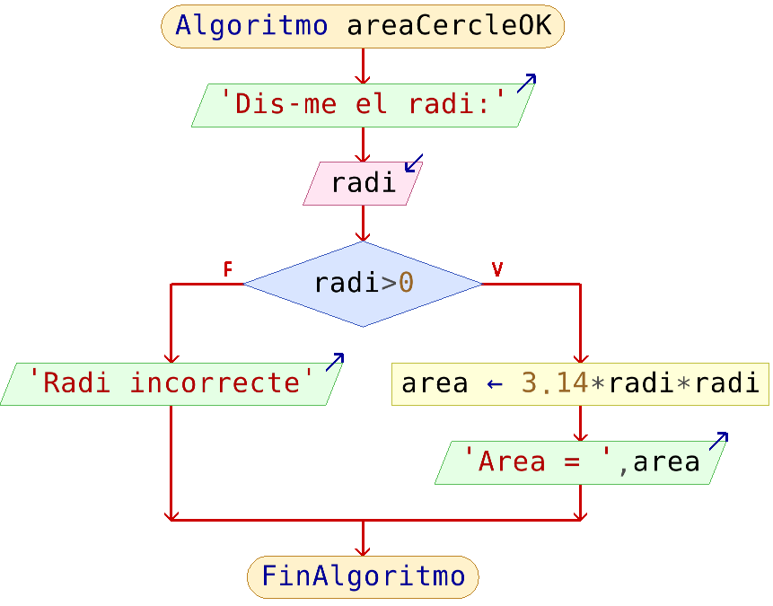
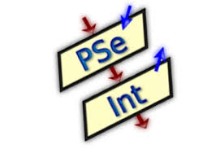

<h1 style="display:none;"># Inici</h1>

# 1. Programació estructurada i algoritmes

## 1.1. Què és la programació estructurada?

La **programació estructurada** és una manera d'organitzar els programes perquè el seu flux d'execució siga clar i fàcil de seguir. Es basa, sobretot, en combinar tres estructures fonamentals:

- **Seqüència**: les instruccions s'executen una darrere de l'altra, de dalt cap a baix.
- **Selecció o bifurcació**: s'executa un bloc o un altre segons una condició.
- **Repetició o bucle**: un bloc d'instruccions es repeteix mentre es complisca una condició o durant una quantitat determinada d'iteracions.

També és habitual aplicar el **disseny descendent**: dividir un problema gran en problemes més menuts i manejables. Més endavant, les funcions ens ajudaran a aplicar esta idea en els programes.

## 1.2. Què és un algoritme?

Un **algoritme** (o algorisme) és una descripció clara, ordenada i no ambigua dels passos necessaris per a resoldre un problema. És independent del llenguatge de programació que s'use després.
És com una recepta: una seqüència de passos que ens diu què hem de fer.


!!! note "Recorda"
    Primer pensem la solució; després la convertim en codi. L'algoritme és el pont entre el problema i el programa (com els plànols que fa l’arquitecte abans de construir la casa).

## 1.3. Com podem representar un algoritme?

| Forma | En què consisteix | Ús en este curs |
|---|---|---|
| **Llenguatge natural** | Descriure els passos amb frases normals. | Útil per a pensar una primera solució. |
| **Pseudocodi** | Escriure els passos amb una sintaxi aproximada a un llenguatge de programació. | El veurem de manera puntual; no cal memoritzar una sintaxi pròpia. |
| **Ordinograma** | Representar gràficament el flux amb símbols i fletxes. | Útil sobretot quan hi ha bifurcacions o bucles i volem visualitzar el flux. |

### Exemple

Volem fer un programa que calcule l'àrea d'un cercle a partir del radi que s'introduirà per teclat, sempre que el radi no siga negatiu.

Independentment del llenguatge que utilitzarem, podem descriure els passos que caldria fer. Veiem com seria l'algoritme en cadascuna de les tres metodologies.

#### Llenguatge natural o informal

- Demanar el radi per teclat.
- Si el radi és positiu, calcular l'àrea i mostrar-la.
- Si no, mostrar un missatge d'error.

#### Ordinograma (diagrama de flux)

{ width="430" }

Un **ordinograma** és una representació gràfica d’un algoritme. Utilitza símbols units per fletxes per a indicar l’ordre d’execució. 
Elements que té un ordinograma:
- **Òval**: inici o final.
- **Rectangle**: acció o càlcul.
- **Paral·lelogram**: entrada o eixida de dades.
- **Rombe**: condició o decisió.
- **Fletxes**: indiquen el flux de l’algoritme.

Els algoritmes se solen fer a mà, però hi ha aplicacions com [PSeInt](https://pseint.sourceforge.net/) (*Pseudocodi Interpretat*) que permeten construir un ordinograma o pseudocodi i executar-lo. L'exemple anterior està fet amb PSeInt.


{ width="130" }

#### Pseudocodi

```text
escriu("Dis-me el radi")
llig radi

si radi > 0
    area = 3.14 * radi²
    escriu("L'àrea és ", area)
si no
    escriu("Radi incorrecte")
```

És fer l’estructura que tindrà el programa però sense preocupar-nos del llenguatge de programació ni entrar en detalls.

Ens **inventem la sintaxi al nostre gust**.

PSeInt pot servir per a construir i executar tant ordinogrames com pseudocodi. Tanmateix, una vegada entés el flux, treballarem directament amb Python.

## 1.4. Qualitat d'un algoritme

- **Correctesa**: ha de donar el resultat esperat per a totes les dades d'entrada vàlides.
- **Eficiència**: ha d'evitar treball innecessari i fer un ús raonable del temps i de la memòria.
- **Senzillesa i claredat**: ha de ser fàcil d'entendre, comprovar i modificar.

## 1.5. De la seqüència al control del flux

Fins ara hem escrit **programes seqüencials**, en què les instruccions s’executen una darrere de l’altra, en el mateix ordre en què apareixen:

```python
nom = input("Nom: ")
edat = int(input("Edat: "))

print(f"{nom} té {edat} anys")
```

A partir d’ara aprendrem a **controlar el flux d’execució** del programa: podrem decidir quines instruccions s’han d’executar segons una condició i també repetir instruccions diverses vegades.
