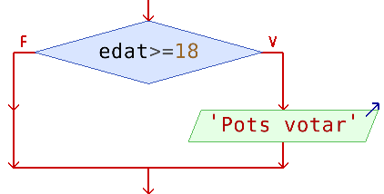
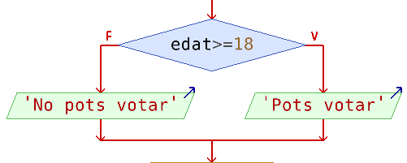
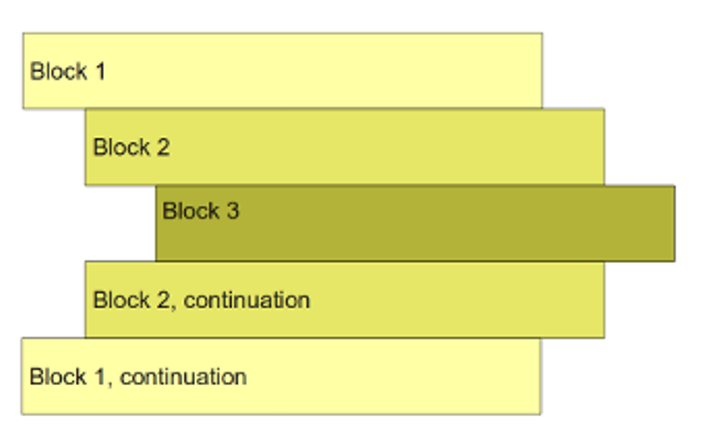
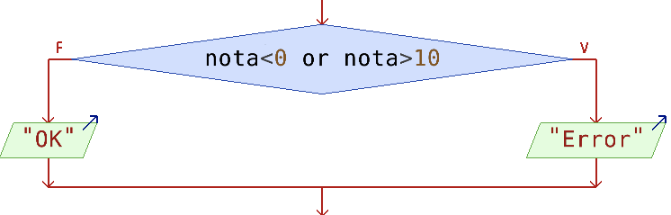
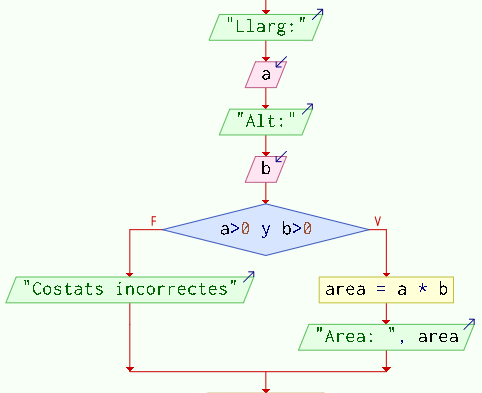
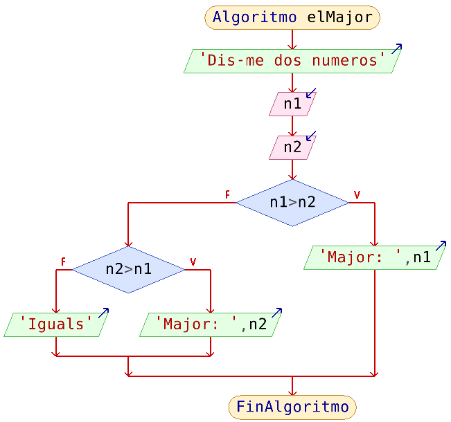
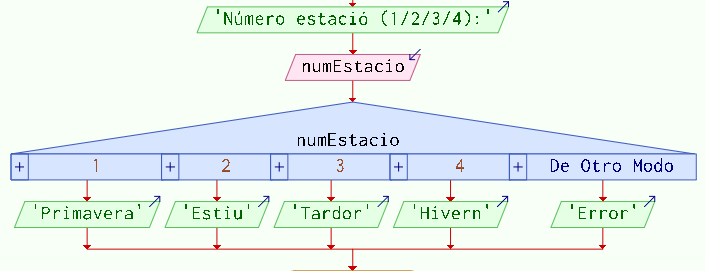

<h1 style="display:none;"># Inici</h1>

# 2. Instruccions de bifurcació

Les instruccions de **bifurcació** (o selecció o de condició) serveixen per a quan volem executar un conjunt d’ordres **només si es compleix alguna condició determinada**.

---

## 2.1. Bifurcació simple: `if`

S'utilitza quan volem executar un bloc només si es compleix una condició.

**Sintaxi:**

```python
if condició:
    acció_1
    acció_2
    ...
    acció_N
```

**Exemple:**


```python
edat = int(input("Dis-me edat:"))

if edat >= 18:
    print("Pots votar")

print("Fi del programa")
```

{ width="430" }

---

## 2.2. Bifurcació doble: `if-else`

Permet triar entre dos camins.

```python
edat = int(input("Dis-me edat:"))

if edat >= 18:
    print("Pots votar")
else:
    print("No pots votar")
```

{ width="430" }

Estes estructures condicionals permeten executar unes instruccions o unes altres segons el resultat d'una **expressió booleana**, és a dir, una expressió que s'avalua a `True` o `False` (en l’exemple: `edat >= 18`).

!!! warning "Sagnat obligatori en Python"

    Les instruccions que depenen d'una condició es diu que formen un **bloc**.

    En Python els blocs van **sagnats obligatòriament** respecte de la condició del bloc.

    ```python
    edat = int(input("Quants anys tens?"))

    if edat < 18:
        print("No pots votar")
        print("No deus beure alcohol")
        print("No deus fumar")
    else:
        print("Pots fer de tot")

    print("Ja ho saps")
    ```

    { width="390" }


!!! question Exercicis sobre bifurcacions `if-else`
    1. Demana un número per teclat. Per pantalla caldrà mostrar si és parell o imparell.
    2. Donats 2 números, mostra el número més gran (igual dona si són iguals).

---

## 2.3. Condicions compostes

Podem unir diverses condicions amb `and`, `or` i `not`.

{ width="430" }

!!! example "Exemple de condició composta"

    Fes un programa en Python que calcule l'àrea d'un rectangle o que mostre un missatge d'error si algun costat no és positiu.

    { width="390" }

    ```python
    a = int(input("Llarg:"))
    b = int(input("Alt:"))

    if a > 0 and b > 0:
        area = a * b
        print(f"L'àrea de {a} i {b} és {a * b}")          
    else:
        print("Costats incorrectes")
    ```


!!! info "Comprovar valor entre 2 límits"
    Recordem que, per a indicar que el valor d’una variable ha d’estar entre dos límits, cal usar una condició composta, amb `and`.
    Per exemple, si volem comprovar que l'`edat` estiga entre `14` i `30`:

    ```python
    edat = int(input("Edat: "))

    if edat >= 14 and edat <= 30:
        print("Pots sol·licitar el Carnet Jove")
    else:
        print("No compleixes el requisit d'edat")
    ```

    Així és com es fa en qualsevol llenguatge de programació, encara que **Python** permet fer-ho amb una altra forma més senzilla, amb **comparacions encadenades**:

    ```python
    if 14 <= edat <= 30:
    ```
    Però ves en compte en altres llenguatges (C, Java...) ja que no admeten estes comparacions encadenades.

!!! info Lleis de De Morgan
    Recorda també les **lleis de De Morgan**: negar un `and` el converteix en `or`, i negar un `or` el converteix en `and`, negant al mateix temps cadascuna de les condicions.

    !!! question "Quina condició caldria posar en este `if`? 

        ```python
        edat = int(input("Edat: "))

        # Pensa que és la condició contrària a: edat >= 14 and edat <= 30
        if ________________________:
            print("No compleixes el requisit d'edat")
        else:
            print("Pots sol·licitar el Carnet Jove")
        ```

 
---

## 2.4. `if` niuats

Podem posar instruccions de bifurcació dins d’altres.
{ width="430" }

És a dir: una estructura `if` dins d'un altre `if`, o dins d'un `else`.

!!! example "Exemple d'`if` niuat"
    ```python
    edat = int(input("Edat: "))

    if edat >= 18:
        print("Eres major d'edat")
        carnet = input("Tens carnet? (s/n): ")

        if carnet == "s":
            print("i tens carnet")
        else:
            print("però no tens carnet")
    else:
        print("Eres menor d'edat")
    ```


!!! example "Altre exemple d’`if` niuat, més complex:"

    ```python
    edat = int(input("Quants anys tens?"))

    if edat < 0:
        print("Error")
    else:
        print("Edat correcta")

        if edat < 12:
            print("No has fet ESO")

            if edat < 6:
                print("No has fet primària")
            else:
                print("Estàs en primària")

            print("Has de fer ESO")

        elif edat < 16:
            print("Estàs en ESO")
        elif edat < 65:
            print("Estàs en edat de treballar")
        else:
            print("Xe, jubila't!")

        print("T'he dit coses segons l'edat")

    print("Adéu")
    ```


!!! question "Exercicis sobre `if` niuats"
    1. Donats 3 números, mostra quin és el més gran. **Consell:** guarda en una variable `major` el número més gran. Després, mostra eixa variable.
    2. Donats 3 números, comprova si es poden correspondre a les longituds dels costats d’un triangle. **Pista**: pots resoldre l’exercici amb una d’estes 2 formes:
        a) Comprovar que la suma dels 2 costats més xicotets és major que el costat més gran.
        b) Comprovar que la suma de qualsevol parella de costats és major que l’altre costat.

## 2.5. Bifurcació múltiple: `if-elif-else`

Quan hi ha més de dos casos possibles, podem encadenar condicions amb `elif`. És a dir, és un `else` i, a continuació, un `if`.

!!! example "Exemple d'estructura `if-elif-else`"
    ```python
    nota = float(input("Nota: "))

    if nota < 0 or nota > 10:
        print("Error")
    elif nota < 5:
        print("Insuficient")
    elif nota < 6:
        print("Suficient")
    elif nota < 7:
        print("Bé")
    elif nota < 9:
        print("Notable")
    else:
        print("Excel·lent")
    ```

    Python prova les condicions **de dalt cap a baix** i executa **només** el primer bloc que correspon.


!!! question "Exercicis sobre `if-elif-else`"
    1. Llig dos números de teclat i una lletra, que serà el codi d’operació (`'s'`: suma / `'r'`: resta / `'m'`: multiplicació / `'d'`: divisió). Caldrà mostrar el resultat de l’operació demanada. Si no s’ha introduït un codi d’operació correcte, cal mostrar un error. Fes-ho amb l’estructura `if-elif-else`.

## 2.6. `match-case`

Des de Python 3.10 existeix `match-case`. És útil quan volem executar un bloc diferent per a cadascun dels **valors concrets d’una mateixa variable**.

En un ordinograma es podria representar així:

{ width="650" }

És a dir: primer posem la variable, i després els diferents valors als quals volem associar accions.

!!! example "Exemple de match-case"

    ```python
    estacio = int(input("Estació (1-4): "))

    match estacio:
        case 1:
            print("Primavera")
        case 2:
            print("Estiu")
        case 3:
            print("Tardor")
        case 4:
            print("Hivern")
        case _:  # Altres casos
            print("Valor incorrecte")
    ```

!!! note "Els `match-case` es podrien fer amb `if-elif`?"
    Sí, però quan les condicions són sobre els possibles valors concrets d'una mateixa variable, amb `match-case` queda més clar i compacte.
    Fixa't que amb `elif` estem repetint les condicions "estacio == ":

    ```python
    estacio = int(input("Estació (1-4): "))

    if estacio == 1:
        print("Primavera")
    elif estacio == 2:
        print("Estiu")
    elif estacio == 3:
        print("Tardor")
    elif estacio == 4:
        print("Hivern")
    else:
        print("Valor incorrecte")
    ```


!!! note "Els `if-elif` es podrien fer amb `match-case`?
    No sempre. Només quan volem accions per valors concrets d’una mateixa variable.
    Per exemple, **no** ho podrem fer amb `match-case` si les condicions no són amb la igualtat (==) sinó amb rangs (<, >):
    ```python
    nota = float(input("Nota: "))
    if nota < 0 or nota > 10:
        print("Nota incorrecta")
    elif nota >= 5:
        print("Aprovat")
    else:
        print("Suspés")
    ```


### Exercicis: instruccions de bifurcació `match-case`

!!! question "Exercicis amb match-case"
    1. Fes l’exercici de la calculadora però amb `match-case`.


