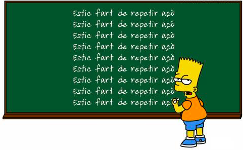
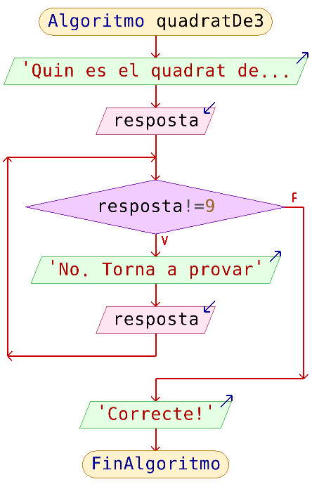
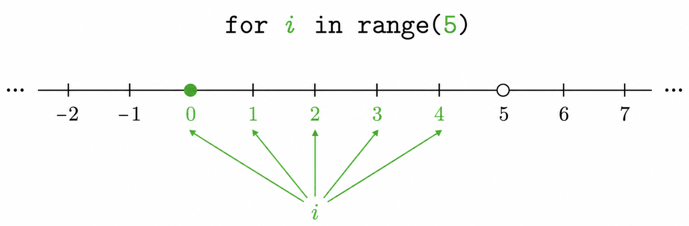
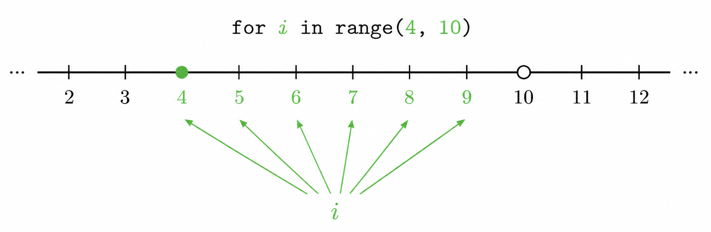
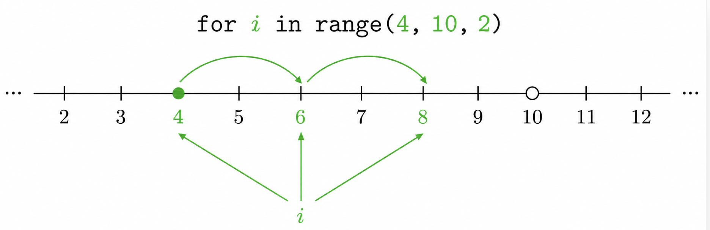
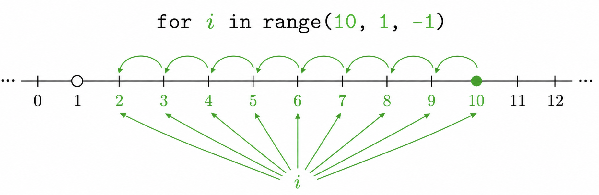
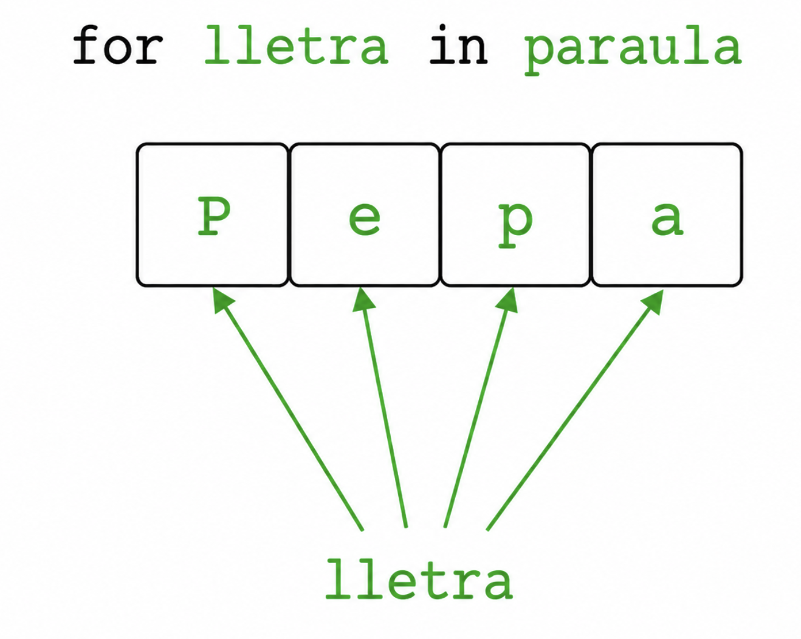
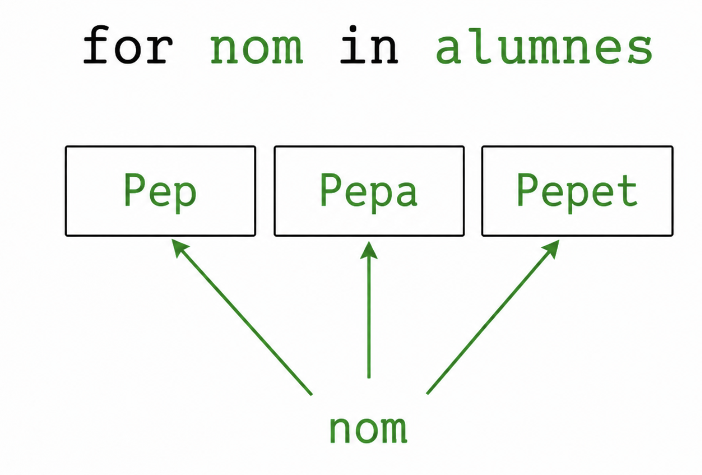
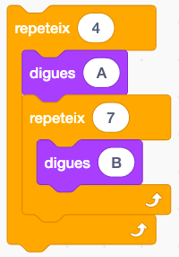
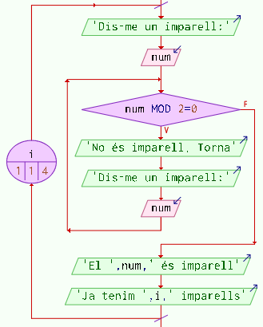

<h1 style="display:none;"># Inici</h1>

# 3. Bucles

A voltes necessitarem repetir un mateix conjunt d’instruccions diverses vegades.

La pregunta clau és: **sabem per endavant quantes vegades s’han de repetir?** Segons la resposta, utilitzarem un tipus de bucle o un altre.

| Situació | Estructura | Exemple |
|---|---|---|
| No sabem quantes iteracions caldran; depén d'una condició. | `while` | Demanar una contrasenya fins que siga correcta. |
| Sabem quantes iteracions volem. | `for` | Mostrar una taula de multiplicar (10 vegades una multiplicació). |

{ width="360" }

## 3.1. Bucle condicional: `while`

Amb l’estructura `while` posarem en un bloc aquelles instruccions que volem que s’executen repetidament **mentre es complisca una determinada condició**.

!!! note "Exemple de bucle while en un ordinograma"
    Demana per teclat quin és el quadrat de 3 fins que siga encertat.
    { width="300" }

### Sintaxi del bucle `while` en Python

El bucle `while` repeteix un bloc d'instruccions **mentre es complisca una condició**.

La seua sintaxi és:

```python
while condició:
    instruccions
```

!!! exemple "Exemple de bucle while"
    Este seria el codi en Python per a l'exemple de l'ordinograma anterior:

    ```python
    resposta = int(input("Quin és el quadrat de 3? "))

    while resposta != 9:
        print("No. Torna a provar")
        resposta = int(input("Quin és el quadrat de 3? "))

    print("Correcte!")
    ```


Perquè un `while` funcione correctament, cal:

1. Posar almenys una variable en la condició del `while`.
2. Inicialitzar abans del bucle les variables que apareixen en la condició.
3. Modificar dins del bucle alguna variable que puga fer que la condició deixe de complir-se.

Fixa’t que es compleixen eixes tres coses a l’exemple anterior.

!!! warning "Idea clau"
    Si la condició no pot arribar mai a ser `False`, tindrem un **bucle infinit**.

!!! question "Exercicis de bucles condicionals(`while`)"
    1. Demana una lletra fins que siga una vocal. Després, mostra la vocal.
    2. Demana l’any de naixement i el de defunció d’una persona. Caldrà demanar-ho repetidament fins que siguen dades coherents (l'any de defunció no pot ser anterior al de naixement, ni pot haver nascut en un futur). Després, mostra quants anys ha viscut.

## 3.2. Bucle incondicional: `for`

Este tipus de bucles es fa quan el programador **ja sap quantes vegades** s'han de repetir un conjunt d'instruccions (o bé eixa quantitat està guardada en una variable).

Per exemple, si volem que un bloc d'instruccions s'execute 5 vegades, utilitzarem una estructura `for`, amb una **variable de control**. En cada iteració, la variable de control prendrà un valor diferent, segons el cas.

!!! example "Exemple 1: `range(5)`"

    Volem mostrar 5 voltes `"Hola, món!"`:

    ```python
    for i in range(5):
        print("Hola, món")
    ```

    { width="680" }

    !!! note "La variable `i` del `for`"
        En compte de la `i`, podem utilitzar qualsevol variable. En cada iteració del bucle, esta variable pren successivament els diferents valors generats per `range()`. A l’exemple anterior, amb `range(5)`, la `i` pren els valors **0, 1, 2, 3, 4**.

    !!! example "Exemple 2: valor inicial i final. `range(4,10)`"

    Indiquem en `range()` un valor inicial i un final (**sempre s’exclou el final**):

    ```python
    for i in range(4, 10):
        print("Hola", i)
    ```

    { width="680" }

    Mostrarà:

    ```text
    Hola 4
    Hola 5
    Hola 6
    Hola 7
    Hola 8
    Hola 9
    ```

!!! example "Exemple 3: indicar com avança. `range(4, 10, 2)`

    També podem indicar com avança la variable. Per exemple, de 2 en 2:

    ```python
    for i in range(4, 10, 2):
        print(i)
    ```

    { width="680" }

    Mostrarà els números: **4, 6, 8**.

!!! example "Exemple 4: anar cap arrere. `range(10, 1, -1)`"

    També podem anar “cap arrere” si indiquem el bot negatiu:

    ```python
    for i in range(10, 1, -1):
        print(i)
    ```

    { width="680" }

    Mostrarà els números: **10, 9, 8, 7, 6, 5, 4, 3, 2**.

!!! note "La funció `range()`"

    Recorda:

    - `range()` genera una seqüència de valors enters.
    - El valor final **mai s’inclou**.
    - Admet diversos paràmetres:
        - **Un**: valor final (el valor inicial serà el 0).
        - **Dos**: valor inicial i final.
        - **Tres**: valor inicial, final i bot.

### Bucle `for` sense `range()`

En compte de "recórrer números d'un rang", podem recórrer els **elements d’una cadena** de text o els **elements d'una llista**:

!!! example "Recorrem una cadena"
    ```python
    paraula = "Pepa"

    for lletra in paraula:
        print(lletra)
    ```

    { width="520" }
    Mostrarà:

    ```text
    P
    e
    p
    a
    ```

!!! example "Recorrem una llista"
    Ja vorem les llistes detalladament, però en este exemple ja podem vore que si tenim una llista d'elements, podem accedir a cadascun d'eixos elements:

    ```python
    alumnes = ["Pep", "Pepa", "Pepet"]

    for nom in alumnes:
        print("Benvingut,", nom)
    ```

    { width="520" }
    Mostrarà:

    ```text
    Benvingut, Pep
    Benvingut, Pepa
    Benvingut, Pepet
    ```

!!! question "Exercicis de bucles incondicionals (`for`)"
    1.  Demana per teclat quants números es volen mostrar. A continuació, es mostraran els números des d’eixe número fins a l’1 inclòs (en ordre decreixent).
    2.  Mostra els números de l’1 al 100 que siguen múltiples de 3 i de 5.
    3.  Demana un valor inicial (`vi`) i un valor final (`vf`). Mostra els valors que hi ha entre ells però de 3 en 3. El valor inicial pot ser major que el final.
        **Exemples:**
        ```text
        vi=10 vf=20   →   10, 13, 16, 19
        vi=20 vf=10   →   20, 17, 14, 11
        ```

    4. Programa que demane una taula de multiplicar i la mostre (amb un `for`, clar). Per exemple, si hem introduït el 9 caldrà mostrar:

        ```text
        9 x 1 = 9
        9 x 2 = 18
        9 x 3 = 27
        ...
        9 x 10 = 90
        ```

## 3.3. Bucles niuats

Podem posar un bucle dins d'un altre. Cada iteració del **bucle exterior** executarà completament el **bucle interior**.

### Exemple 1

Suposem que volem produir este resultat, amb bucles:

```text
A BBBBBBB
A BBBBBBB
A BBBBBBB
A BBBBBBB
```

Observem que són **4 línies**. Per tant, seria un `for` de 4 repeticions.

I com fer cada línia? Posant una `A` i després 7 lletres `B`: un `for` de 7 repeticions.

```python
for linia in range(4):
    print("A ", end="")

    for lletra in range(7):
        print("B", end="")

    print()
```

{ width="180" }

Quan s’executen bucles niuats, **per cada iteració del bucle exterior s’executen totes les iteracions del bucle interior**. Quan el bucle interior acaba, es continua amb la següent iteració del bucle exterior i el bucle interior torna a executar-se completament. Així successivament fins que finalitza el bucle exterior.

### Exemple 2

Volem que per teclat s’introduïsquen **4 números imparells**.

La idea és fer un `for` que s’execute 4 vegades, per a demanar un número per teclat.

Però cada vegada que es demane un número per teclat, caldrà controlar, amb un altre bucle, que es torne a demanar eixe número mentre el número introduït no siga imparell. Per tant, un altre bucle dins.

Dit d’una altra forma: si volem obtindre de teclat un número imparell, cal un bucle per a demanar contínuament el número fins que siga imparell. Però si volem demanar 4 números imparells, haurem de posar el bucle anterior dins d’un altre bucle.

```python
for i in range(1, 5):
    num = int(input("Dis-me un imparell:"))

    while num % 2 == 0:
        print("No és imparell. Torna")
        num = int(input("Dis-me un imparell:"))

    print(f"El {num} és imparell")
    print(f"Ja tenim {i} imparells")
```

{ width="360" }

!!! note
    Recorda que l’operador `%` calcula el **residu d'una divisió entera**.

### Exercicis: bucles niuats

14. Dibuixa un rectangle de caràcters `x`. Demana per teclat l’alt i ample. Per exemple, si és 4 d’alt i 6 d’ample, caldrà dibuixar:

    ```text
    x x x x x x
    x x x x x x
    x x x x x x
    x x x x x x
    ```

15. Dibuixa el següent triangle de caràcters `x` d’altura `n` (demanada per teclat). Per exemple, si `n` és 4:

    ```text
    x
    x x
    x x x
    x x x x
    ```

16. Dibuixa el següent triangle d’altura `n`. Per exemple, si `n` és 4:

    ```text
    x x x x
    x x x
    x x
    x
    ```

17. Dibuixa el rectangle d’abans, però ara només el contorn:

    ```text
    x x x x x x
    x         x
    x         x
    x x x x x x
    ```

18. Mostra les taules de multiplicar del 2 al 9.

    **Pista:** ja havies fet, amb un bucle, una taula de multiplicar. Ara es tracta de posar eixe tros de codi dins d’un altre bucle, ja que volem moltes taules.

    Posa també un titolet abans de cada taula: `"Taula del 2"`, `"Taula del 3"`...

!!! note "Recorda"
    Per a escriure sense que faça després un salt de línia podem usar `print(..., end="")`.
