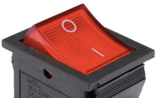

<h1 style="display:none;"># Inici</h1>

# 4. Patrons habituals dins dels bucles

Aprendre la sintaxi dels bucles no és suficient. Molts problemes es resolen combinant-los amb **patrons que apareixen una vegada i una altra**.

## 4.1. Comptadors

Un **comptador** és una variable destinada a comptar quantes vegades ha ocorregut alguna cosa. Sol usar-se en els bucles (`while` o `for`).

L’ús del comptador té dues instruccions bàsiques:

```text
Abans del bucle:
    comptador = 0

BUCLE
    ...
    si (...)
        comptador += 1
    ...
FI_BUCLE
```

**Exemple:** demanem 10 números i volem saber quants números negatius hem posat.

```python
cNeg = 0  # Comptador de negatius

for i in range(10):
    num = int(input())

    if num < 0:
        cNeg += 1

print(cNeg, "negatius has introduït")
```

!!! note
    Els bucles `for` porten implícit un altre comptador. En este cas és la variable `i`, que compta les vegades que s'executa el codi de dins del bucle.

### Exercicis: ús de comptadors

19. Pregunta quina és l’arrel quadrada de 225 fins que siga encertat. Finalment, mostra quants intents s’han fet.
20. Imprimix quants (no quins) números hi ha entre 1 i 100 que siguen múltiples de 2, quants múltiples de 3 i quants múltiples de 2 i de 3 al mateix temps.
21. Llig uns quants números (fins que posem el 0). Mostra quants positius, quants negatius i quants acaben en 0.

## 4.2. Acumuladors

Un **acumulador** és una variable destinada a acumular diferents quantitats.

Un acumulador és com un comptador però, en compte de sumar 1, sumarem diferents quantitats: **no volem comptar sinó acumular quantitats**.

```text
Abans del bucle:
    acumulador = 0

BUCLE
    ...
    acumulador += quantitat
    ...
FI_BUCLE
```

**Exemple:** volem acumular l’import d’una factura (moltes `quantitat * preu`):

```python
q = int(input("Quantitat:"))
total = 0

while q != 0:
    p = int(input("Preu:"))
    total += q * p
    q = int(input("Quantitat:"))

print("Total:", total)
```

### Exercicis: ús d’acumuladors

22. Demana les notes dels 23 alumnes de la classe. Mostra la nota mitja.
23. Introduïx 2 valors A i B (`A < B`). Incrementa A de 2 en 2 i decrementa B de 3 en 3 fins que `A > B`. En cada iteració del bucle ves mostrant els valors d’A i de B.
24. Demana 2 números per teclat i mostra la multiplicació dels dos... però sense usar l’operador de la multiplicació (`*`). És a dir: hauràs de sumar un dels dos números tantes vegades com diu l’altre número.

## 4.3. Acumuladors de productes

Generalment, la quantitat va sumant-se a l’acumulador, però també podria **multiplicar-se**. Cal tindre en compte això per a iniciar l’acumulador:

1. Si volem **sumar** quantitats, el valor inicial sol ser `0`.
2. Si volem **multiplicar** quantitats, el valor inicial sol ser `1`.

### Exercici resolt: ús d’acumuladors de productes

25. Donats 2 números (`base` i `exp`) calcula la potència (`base^exp`). Se suposa que la potència no és un operador ni cap funció predefinida.

```python
base = int(input("Base:"))
expo = int(input("Exponent:"))

pot = 1

for i in range(expo):
    pot *= base

print("Potència:", pot)
```

!!! note
    Si inicialitzàrem `pot` a `0`, el producte sempre donaria `0`.

### Exercicis: ús d’acumuladors de productes

26. Programa que mostre el factorial d’un número introduït per teclat (`n`), tenint en compte que:

    - Si `n` és 0, el factorial és 1.
    - Si no, el factorial és `n * (n-1) * (n-2) * ... * 2 * 1` (sent `n > 1`).

## 4.4. Interruptors

Els **interruptors** (també coneguts com indicadors, banderes o *flags*) són variables destinades a indicar si en alguna de les iteracions d’un bucle **ha passat o no una cosa determinada**.

Estes variables seran de tipus lògic (booleà), ja que només guardaran dos possibles valors: ha passat alguna cosa (`True`) o no (`False`).

{ width="150" }

**Exemple:** després d’introduir les 24 edats de l’alumnat caldrà mostrar per pantalla si hi havia algun menor d’edat o no. Compte! No ens interessen quants menors: **no cal un comptador**.

```python
menors = False

for alu in range(24):
    edat = int(input("Edat:"))

    if edat < 18:
        menors = True

if menors:
    print("Hi ha menors")
else:
    print("Tots majors")
```

| Estat inicial | Quan trobem un menor |
|---|---|
| { width="130" } | { width="130" } |

!!! note
    `if menors:` és equivalent a escriure `if menors == True:`.

### Exercicis: ús d’interruptors

27. Demana 5 noms de persona (amb un bucle). Després digues si algun d’ells es deia `"Pep"` o `"Josep"` o si cap d’ells es deia així.
